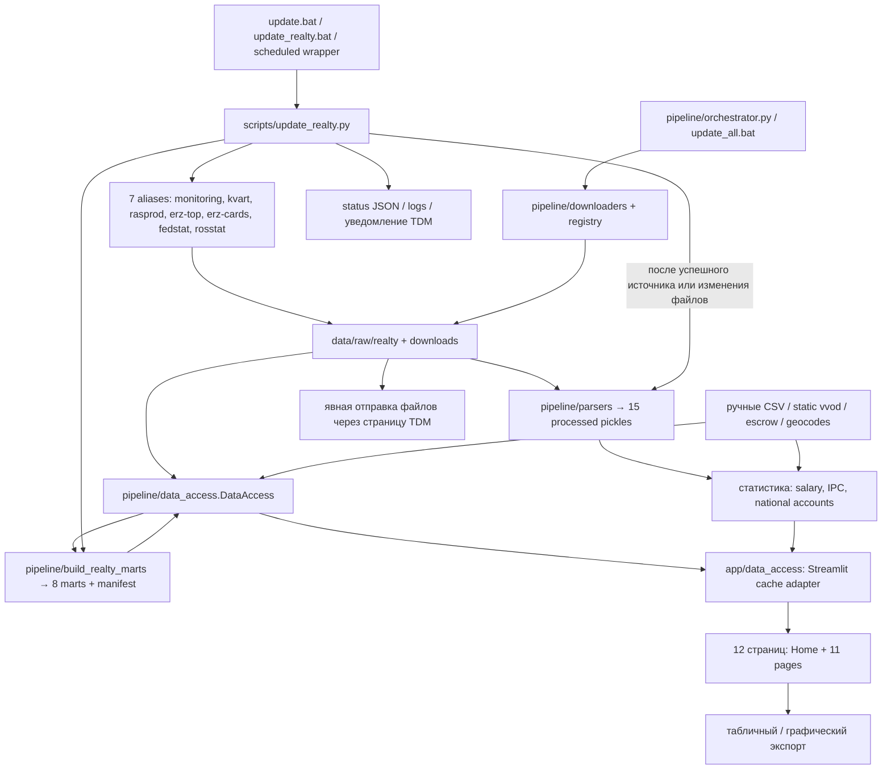

# Карта системы и границы источников

Срез кода и локального состояния: **28.09.2026**. Это инвентаризация существующих
связей, а не подтверждение актуальности внешних публикаций или завершения аудита.
Реестр: [source_registry.csv](source_registry.csv). Статусы выполнения плана
ведутся отдельно в [progress.md](progress.md). Gdebenz исключён пользователем:
задание удалено, удаление локальных файлов заблокировано; оставшиеся файлы не
считаются действующим источником и здесь не изменялись.

## 1. Два пути обработки одних raw

`pipeline/registry.py` содержит **15 Indicator**: 8 статистических и 7 realty.
Они дают `data/processed/<indicator_id>.pkl` через long-формат
`pipeline/parsers`. Однако realty-страницы читают словари и широкие таблицы из
**8 других** файлов `data/marts/realty/*.pkl`; их строит `DataAccess` прямо из raw.
Наличие processed-файла не доказывает наличие или эквивалентность UI-витрины.

На момент чтения кода общий loader уже перенесён в `pipeline/data_access.py`:
`DataContext` задаёт пути и режим чтения, `DataAccess.source_files()` задаёт
выбор входов, `app/data_access.py` служит адаптером к Streamlit cache.
Перенос снимает прямой импорт Streamlit из сборщика витрин, но сам по себе не
объединяет реализацию `pipeline/parsers/*` и предметные loaders. Проверки и
приёмка текущего рефакторинга учитываются отдельно, по их фактическому результату.

## 2. Точки запуска и расписание

| Вход | Действие по текущему коду | Наблюдённое ограничение |
|---|---|---|
| `update.bat`, `scripts/update_realty.bat` | `scripts/update_realty.py`; обычно `.venv` при наличии, иначе системный Python | Ручной полный или выборочный запуск |
| `scripts/update_realty_scheduled.bat` | Тот же runner; лог `data/processed/etl_YYYY-MM-DD.log`, загрузка переменных `.env`; per-dev включён при каждом вызове | README обещает недельный per-dev; wrapper не передаёт `--weekly-kvart-per-dev` |
| `scripts/register_scheduler.bat` | Создаёт `parser_etl_realty`, DAILY 06:00 local, `/RL HIGHEST` | Локальный запрос `schtasks /Query /TN parser_etl_realty` 28.09.2026: задание не найдено |
| `scripts/register_scheduler_user.bat` | Создаёт `parser_etl_realty_user`, DAILY 06:00 local | Локальный запрос 28.09.2026: задание не найдено; runner требует включённого компьютера, пользовательский вариант — входа пользователя |
| `scripts/update_all.bat` | `pipeline/orchestrator.py` со скачиванием, лог `data/processed/etl.log` | В комментарии предложено имя `parser_etl`; локальный запрос этого имени 28.09.2026: не найдено |
| `pipeline/run_etl.py`, `scripts/manual_ingest.py` | `run_all(download=False)` по всем 15 Indicator | Нет загрузки; возможны запись processed и штатное уведомление оркестратора |
| `pipeline/orchestrator.py --skip-download` | То же локальное построение processed | Это ETL, а не read-only аудит |
| `scripts/build_realty_marts.bat` | Сборка 8 marts; `--check` проверяет manifest | Не скачивает raw; сам по себе не доказывает внешнюю свежесть |
| `scripts/download_fedstat_34118.bat` / `.py` | Специализированная загрузка двух частей 34118 | Отдельного расписания в wrappers нет |
| `scripts/import_fedstat_34118_manual.py` | Выбор/проверка и копирование ручных Excel из заданной папки или Downloads пользователя | Дата имени копии берётся из mtime исходного файла |
| `scripts/run_monitoring_geocoding_yandex.ps1` | `build_monitoring_geocodes.py --provider yandex`; возможен перезапуск сайта | Отдельная ручная операция; внешние запросы требуют настроенного ключа |
| `start.bat` | Streamlit `app/Home.py`, локально порт 8501 | Это запуск потребителя, не обновление данных |
| `setup.bat` | Bootstrap окружения, ETL/локальная сборка, регистрация расписания, запуск сайта; есть флаги пропуска | Наличие сценария установки не означает, что его шаги выполнены на этой машине |
| `tdm_test.bat` | Диагностика подключения TDM и групп | Может обращаться во внешний сервис; в данной инвентаризации не запускался |

Запросы трёх известных имён задач не устанавливают отсутствие произвольно
переименованного или внешнего расписания. Реальная машина штатного запуска,
условия питания, повтор после пропущенного 06:00, права и доступ без интерактивной
сессии остаются неподтверждёнными. `/RL HIGHEST` сам по себе не подтверждает
выполнение после выхода пользователя; соответствующее обещание комментария
user-wrapper требует проверки реальных параметров задачи.

Волны `update_realty.py`: `[monitoring, kvart, erz-top, rosstat]` →
`[erz-cards]` → `[rasprod]` → `[fedstat]`, лимит по умолчанию 4.
`erz-cards` использует `top_developers_rf_*.json` от top. Есть повторы,
per-source таймауты, `state/.realty_update.lock`, контроль незаконченных загрузок,
дедупликация файлов и архивирование. `pipeline/orchestrator.py` имеет отдельный
`state/.etl.lock`. Согласованность двух механизмов при одновременном запуске
не следует из наличия двух lock-файлов.

## 3. Источники, raw и потребители

| Семейство | Вход / существенная особенность | Потребитель |
|---|---|---|
| Fedstat | `fedstat_checker.INDICATORS` содержит 30 download keys; salary 43246/57824 и IPC 31074 part1/part2 входят в registry; ввод 34118 part1/part2 — отдельный UI loader | `avg_salary.pkl`, `ipc.pkl` → Home/зарплата/ИПЦ; 34118 → ввод; остальные 24 ключа имеют загрузчик, но нормализованный UI-путь не найден |
| Росстат/Мосстат | 6 ключей `PAGE_SOURCES`, requests/Excel → `downloads` | 6 processed datasets → `load_national_accounts` → ВРП/ВВП |
| Мониторинг 2.0 | Google Sheets export всех листов → `data/raw/realty/nashdom/monitoring_2_0_*.xlsx` | processed long; mart `monitoring_2_0`; профиль, ввод, карта; отдельный loader исторических листов |
| Квартирография | Selenium; JSON и XLSX; РФ/Москва, агрегаты и отдельный долгий per-dev обход | processed читает XLSX; mart loader предпочитает пригодный JSON/принимает XLSX; страницы 4, 5 и профиль |
| Распроданность | Selenium, история помесячно; JSON и XLSX | processed читает JSON, mart читает XLSX; страница 6 и профиль |
| ERZ top | 5 сортировок × РФ/Москва; объём ввода также по годам; Excel требует авторизации `config/erzrf.json` | 2 processed; mart `erzrf_top`; список top_developers → cards; профиль |
| ERZ cards | Карточки списка ТОП-100 РФ → `data/raw/realty/erzrf/cards/cards_*.xlsx` | processed long; широкий mart `erzrf_cards`; профиль |
| Ручной escrow | XLSX из ЕИСЖС → `data/raw/realty/escrow_manual`; автоматического download нет | `escrow_manual.py` существует, вопреки старому docstring runner; processed + mart; профиль |
| Ручной ввод | `data/raw/realty/vvod/vvod.xlsx`, `Stroi_111_2025.xls`, `emiss_34118_base.xls`, фильтр `34118_filter.txt` | marts `vvod_static`, `emiss_34118`; страница ввода |
| Ручная/расчётная статистика | `data/derived/salary_2011_2012.csv`; `vds_msk_value_2011_2015.csv` через отдельный скрипт | Добавляются к salary / national accounts; ежедневный ETL эти CSV не обновляет |
| Координаты | Геометрия raw; импорт CSV/XLSX; Yandex/Nominatim; территориальные центроиды | `data/derived/monitoring_geocodes.csv` → `app/realty_map.py` → карта и адресные экспорты |
| Legacy `cloud/domrf.py` | Отдельный Selenium: статистические ряды реализации квартир/нежилых помещений → относительные `downloads`, `domrf_state.json` | Связь с registry, marts, основным runner и UI не найдена; факт действующего запуска неизвестен |

В CSV сохранены все 15 indicator IDs и все 30 Fedstat keys, включая источники без
найденного потребителя. «Источник» в registry и «семейство UI-витрины» — разные
понятия; ручные flows и per-dev перечислены отдельно. Детальные единицы и зерно
из кода отмечены как локальный контракт, а неподтверждённые определения — `unknown`.

Legacy-папки `nashdom/`, `erzrf/`, `escrow_manual/`, `vvod/` всё ещё поддерживаются
`DataAccess` как альтернативные входы. Активные realty-архивы находятся в
`data/raw/realty/_archive`, архив статистики — `data/raw/_archive`.
Текущий индекс DataAccess исключает архивные каталоги; `_to_delete/` не является
штатным live-input. Это не разрешение на очистку: полезность старых файлов и
связи внешних ручных потребителей не подтверждены. В `tools/` Python/BAT/PS1
точек запуска при данном просмотре не обнаружено.

`PARSER_ROOT`, `PARSER_DOWNLOADS`, `PARSER_STATE` влияют на пути общего pipeline,
но standalone checkers используют также относительные пути текущей директории.
Wrappers переходят в корень проекта. State статистики: корневые
`fedstat_state.json`, `rosstat_state.json`; realty: `state/nashdom_state.json`,
`state/erzrf_state.json`. Эти файлы фиксируют состояние сборщика, не его SLA.

## 4. Семантические расхождения и подтверждённые дефекты

| ID | Наблюдение и последствия | Статус / доказательство |
|---|---|---|
| MAP-01 | README описывает недельный per-dev, scheduled wrapper запускает его ежедневно | Подтверждено кодом; выбор желаемого расписания ещё открыт |
| MAP-02 | `realty_update_status.json` содержит `test.xlsx`, `logs/test.log`, даты 06.07.2026; отсутствуют современные поля status/updated_at | Подтверждено локальным чтением; нельзя заменять искусственным успешным статусом; состояние реальных прогонов не доказано |
| MAP-03 | Установленный Selenium в baseline — 4.25.0, requirement — `selenium==4.43.0` | [baseline_environment.json](baseline_environment.json) и `requirements.txt`; это несовпадение окружений, не вывод о работоспособности живого браузера |
| MAP-04 | Мониторинг: дедупликация long-метрик без идентичности исходной строки давала 24 897 → 23 749, потеря 1 148 строк | Пример УИН `HG8891-10-0002-001`, общая площадь 89 081.9 → 28 230.9. Исправление идентичности реализовано; автор core подтвердил 24 897 → 24 897 на одном raw. Это не проверка всей истории; рабочие processed/marts не пересобраны, старые результаты остаются на диске |
| MAP-05 | ERZ: подстановка TOP_EXCEL или фильтрация по названию компании не подтверждают регион и накопленный период | Защитное чтение исправлено, локальные срезы RF/MSK остаются unavailable; [erzrf_region_fix.md](erzrf_region_fix.md) хранит доказательство исходного дефекта; текущая реализация перенесена в общий loader |
| MAP-06 | `top_nakopl_vvod` raw имеют колонки качества вместо ожидаемого ввода; numeric TOP_TYPES 2/3/4 подозрительны | Несовпадение raw-схем подтверждено; перестановка значений URL — **гипотеза**, DOM/живая проверка source_contract ожидается |
| MAP-07 | `Indicator.unit` упрощает набор: мониторинг «шт», кварт/распрод «%», escrow «млн руб», cards «—»; VDS Москвы в registry «млрд руб», в parser `vds_value` — «млн руб» | Парсеры фактически выпускают несколько единиц: м²/тыс.м²/руб/%/месяцы/счётчики; ERZ также дней/дом. Единицу нужно брать у метрики, не у названия набора |
| MAP-08 | CSV `data/derived/*.csv` читаются общей функцией, включая адресные файлы; далее consumers фильтруют section/indicator_id | Найдено по коду; явный реестр производных статистических таблиц ещё следует согласовать |
| MAP-09 | `SOURCE_MARTS` связывает 34118/статичный ввод с alias `rosstat`, хотя живые 34118 скачивает Fedstat | Это внутренняя классификация изменённых файлов; она не свидетельствует об отдельной автоматической загрузке ручных static files |

Long-парсер квартирографии обрабатывает только `apartments`, `distribution`,
`developers`, `regions`; UI payload включает дополнительные per-dev данные.
Парсер распроданности и UI читают разные сериализации одного сбора, и их равенство
нужно проверять. Мониторинг UI дополнительно нормализует/объединяет исторические
листы и использует предметные срезы, а ETL разворачивает исходные строки в метрики.
ERZ parser выбирает доступную основную метрику по колонкам, UI хранит таблицы по
сортировкам. Escrow long-метрики измеряются в рублях/м²/%/месяцах; UI рассчитывает
агрегаты из широких строк. Такие различия не следует скрывать общим ярлыком
«единый DataFrame».

## 5. Даты, метаданные и внешние действия

Не смешивать период показателя, дату публикации источника, время получения файла,
время parse/build и время успешного опроса. Дата в имени realty-файла обычно
является датой сборки имени; `loaded_at` — временем обработки; `mtime` и
`manifest.sources[].mtime` — метаданными файлов. `latest_raw_source_date` и
`latest_realty_mart_source_date` сейчас возвращают именно такие файловые даты,
а не доказанную дату публикации источника. Freshness-check manifest сравнивает
локальные версии; без внешнего опроса он не устанавливает внешнюю актуальность.

Fedstat state хранит прочитанную дату последнего обновления; Rosstat state — дату,
URL и имя файла. Nashdom может хранить `report_date`; смысл snapshot/report period
нужно проверять по отдельному контракту. Срок публикации и допустимая задержка
для каждого источника пока `unknown`, если не указаны в подтверждённом контракте.

`pipeline/tdm_notify.py` и `pipeline/notifier.py` обеспечивают исходящие
уведомления; страница отправки использует `app/tdm_files.py` для активных файлов
realty и допускает пользовательский upload. Это подтверждённые исходящие
потребители, но не доказанный входящий бот запросов. Внешние отправки и загрузки
в рамках этой инвентаризации не выполнялись; секреты не читались и не включены.

## 6. Проверенное покрытие и открытая приёмка

В CSV 59 строк: 15 записей зарегистрированных наборов, 30 отдельных ключей
Fedstat и 14 вспомогательных/ручных/legacy flows. Это пересекающиеся уровни
описания, а не 59 независимых внешних источников.

Прослежены 7 алиасов основного runner, все 15 записей registry, все 30 ключей
Fedstat, 6 ключей Rosstat, 8 marts, импорты loaders всех 12 страниц, перечисленные
ручные/географические flows и legacy cloud. CSV проверяется на уникальность
ключей, полноту registry/Fedstat и читаемость UTF-8. Это полнота обнаруженных
локальных кодовых связей; неизвестные внешние/ручные потребители не исключены.

[baseline.csv](baseline.csv) и [методика](baseline_methodology.md) покрывают
8 готовых marts × 3 режима × 5 повторов = 120 наблюдений без ошибок, **после** ERZ
исправления, до последующих изменений core. Они не измеряют полный download/ETL,
долгий per-dev, браузерный render, touch/UI, экспорт и сеть. Перенос результатов
на текущую версию core требует нового сравнимого замера.

Открыты: live source contracts и периодичность публикации, правильные ERZ
topType, независимые эталоны/ключи/единицы, историческая приёмка monitoring fix и
пересборка рабочих результатов, реальное
расписание и пропущенные запуски, точная геопривязка, происхождение ручных наборов,
постоянное размещение, нагрузка/восстановление, визуальная мобильная проверка и
бот. [mobile_layout.md](mobile_layout.md) описывает первый проход UI с
невыполненной браузерной/физической приёмкой. Полный этап E1 и весь план этим
документом не закрываются.
